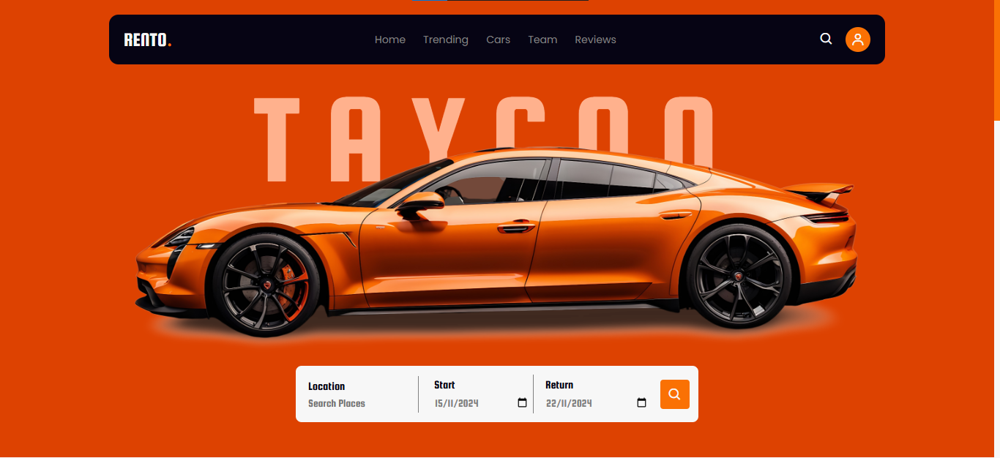
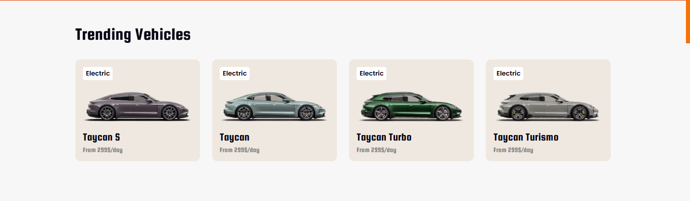
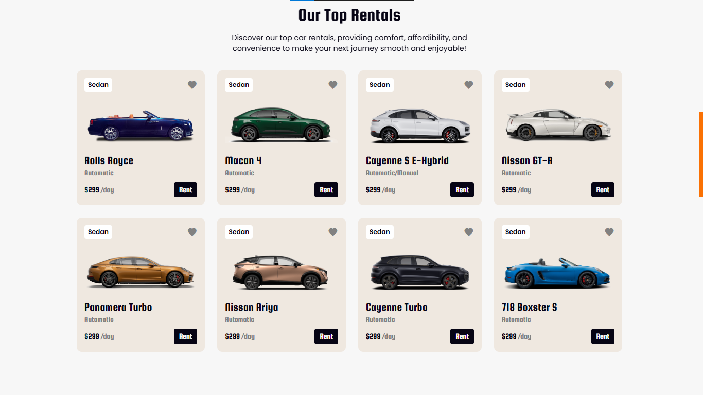

# Rento - Rent A Car 🚗

Rento is a beginner-level car rental website project designed to showcase web development skills using **HTML**, **CSS**, and basic **JavaScript**. The website offers an engaging and user-friendly interface, featuring various sections like trending cars, top rentals, team introductions, customer reviews, and subscription options.

## Features ✨

- **Responsive Design**: The website adjusts seamlessly to various screen sizes, ensuring a smooth user experience.
- **Search and Filter Options**: A functional form allows users to search for car rental locations and set start and return dates.
- **Trending Section**: Highlights popular vehicles available for rent.
- **Top Rentals**: Displays the most rented cars with details like price and type.
- **Team Section**: Introduces the team behind Rento.
- **Customer Reviews**: Showcases positive feedback from past customers.
- **Newsletter Subscription**: Offers a subscription option with a discount incentive.
- **Contact Information**: Includes contact details, social media links, and operating hours.
- **Footer Section**: Neatly summarizes navigation links and provides additional contact information.

## Technology Stack 💻

- **HTML**: Structure and layout of the website.
- **CSS**: Styling and responsive design.
- **JavaScript**: Interactivity (e.g., navigation toggle, form enhancements).
- **BoxIcons**: Icons used for UI design.
- **ScrollReveal**: Animation library for smooth reveal effects.

## How to Use 📖

1. **Clone the Repository**

   ```bash
   git clone https://github.com/shozabali06/rento.git
   ```

2. **Open in Browser**  
   Simply open the `index.html` file in your preferred web browser.

3. **Explore Features**  
   Navigate through different sections, interact with forms, and experience the animations.

## Project Structure 📁

```plaintext
Rento/
├── index.html         # Main HTML file
├── style.css          # CSS for styling
├── script.js          # JavaScript for interactivity
├── images/            # Folder containing images used in the website
└── README.md          # Project documentation (this file)
```

## Screenshots 📸

### Home Section



### Trending Cars



### Top Rentals



### Team Introduction


## Credits 🙌

- **Creator**: [Shozab Ali](https://github.com/shozabali06)
- **Icons**: [BoxIcons](https://boxicons.com)
- **Animations**: [ScrollReveal](https://scrollrevealjs.org)

## License 📜

This project is licensed under the MIT License. Feel free to use, modify, and distribute.

---

**Connect with me on [GitHub](https://www.github.com/shozabali06) for more projects!** 🎉
